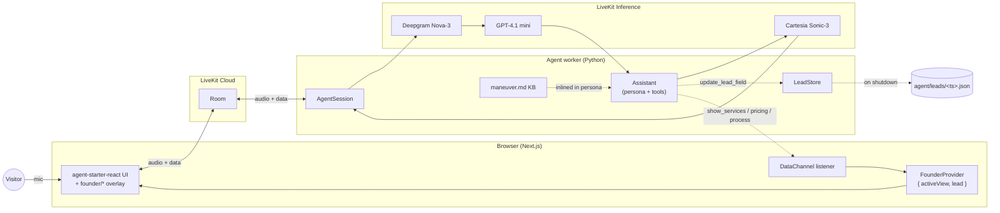

# Talk to Founder — Maneuver

A voice AI web app where a visitor has a real conversation with "Sara," the founder of Maneuver. The agent runs a discovery call by default, flips into Q&A about Maneuver when asked, and drives a synchronized visual layer on screen — slides appear *with* her voice, and a live lead panel fills in as she learns each fact about the caller.

Built for the Maneuver intern assignment, using [LiveKit Agents](https://docs.livekit.io/agents/) for the voice loop and Next.js / React for the web frontend.

---

## What it does

- **Real-time voice conversation.** Visitor lands on the page, clicks one button, talks to Sara. Browser audio in, Sara's voice out. Interruptions handled — talk over her and she stops within ~300 ms.
- **Two modes, one agent.** Discovery is the default — Sara asks about you and what you're working on, one question at a time. Q&A flips automatically when you ask about Maneuver's services, process, or pricing, then she steers back to discovery.
- **Lead capture.** As Sara learns each fact (name, company, problem, timeline, budget…), an `update_lead_field` tool fires silently and the data is persisted to `agent/leads/<timestamp>.json` on call end, alongside the full transcript.
- **Follow-up Slack ping.** If `SLACK_WEBHOOK_URL` is configured, the agent fires a real Slack message at call end — a three-sentence LLM-generated summary of the call plus the captured fields and a pointer to the saved transcript. No-op if the webhook isn't set.
- **Synchronized visual layer.** When Sara mentions services, the services slide appears before she's done with her first sentence. Same for the process diagram, pricing card, and service detail zooms. The agent calls visual tools *before* speaking — visuals lead the voice, not lag it.
- **Live lead panel.** Captured fields appear in a right-side panel that flashes the just-updated field. The visitor sees what Sara heard.

---

## Stack

| Layer | Choice | Why |
| --- | --- | --- |
| Voice pipeline | LiveKit Agents (Python) + LiveKit Cloud | Single SDK for STT→LLM→TTS plus turn detection, interruption handling, and frontend transport. One set of creds. |
| STT | Deepgram Nova-3 (via LiveKit Inference) | Lowest-latency English STT we have ready access to; multilingual mode tolerates accents. |
| LLM | OpenAI GPT-4.1 mini (via LiveKit Inference) | Started on GPT-5.2 Chat — too slow (~3 s TTFT). 4.1 mini is roughly 3× faster, still reliable for tool calling. |
| TTS | Cartesia Sonic-3 (via LiveKit Inference) | Lowest TTFB of any TTS we evaluated; "Jacqueline" voice with `speed=0.9` for a more natural founder pace. |
| Turn detection | LiveKit MultilingualModel + Silero VAD | Context-aware turn endpoints, not just silence detection. Tuned `min_delay` to 0.2 s for snappy responses. |
| Frontend | Next.js 15 + React 19 + Tailwind 4 + shadcn/ui + Motion | The `agent-starter-react` template ships with these. |
| Transport | LiveKit data channels (broadcast) | Used instead of RPC because slide commands are fire-and-forget, no destination-identity lookup needed. |
| State | React Context + reducer | A handful of slots — no need for Zustand or anything heavier. |
| Persistence | Local JSON files in `agent/leads/` | This is a discovery demo, not a CRM. A `lk shutdown_callback` writes the lead + transcript when the room closes. |

LiveKit Inference proxies STT/LLM/TTS through LiveKit's infrastructure, so the project only needs **three credentials** total (`LIVEKIT_URL`, `LIVEKIT_API_KEY`, `LIVEKIT_API_SECRET`) — no separate Deepgram/OpenAI/Cartesia keys.

---

## Architecture



**Key contracts**

- The agent's `update_lead_field`, `show_services`, `show_service_detail`, `show_process`, `show_pricing`, and `clear_visual` tools all publish JSON data messages to the room. Topics: `visual` for slide commands, `lead` for lead-panel updates. The frontend's `useFounderDataChannel` hook decodes and dispatches into the reducer.
- The agent's persona explicitly instructs it to call visual tools *before* speaking the relevant answer — that's how slides land with the first sentence rather than after the third.
- The KB (`agent/knowledge/maneuver.md`) is inlined into the system prompt. Prompt caching keeps subsequent turns fast.

---

## Repository layout

```
agent/                          # LiveKit Python agent
├── src/
│   ├── agent.py                # Entry point — pipeline, Assistant, tools, shutdown
│   └── lead.py                 # Lead Pydantic model + LeadStore
├── knowledge/
│   └── maneuver.md             # Source of truth for Q&A mode
├── tests/
│   ├── test_agent.py           # Behavioral tests (persona, grounding, safety)
│   └── test_lead_capture.py    # Tool-call tests + LeadStore unit tests
├── leads/                      # JSON artifacts from each call (gitignored)
└── pyproject.toml

web/                            # Next.js frontend
├── app/                        # Next 15 app router
├── components/
│   ├── app/                    # Layout, welcome, view-controller (template)
│   ├── agents-ui/              # LiveKit React components (template)
│   └── founder/                # ↓ new for this project
│       ├── content.ts          # Mirrored Maneuver content for the slides
│       ├── state.tsx           # Context + reducer
│       ├── use-data-channel.ts # Subscribes to RoomEvent.DataReceived
│       ├── shell.tsx           # Wraps app, mounts overlay + lead panel
│       ├── overlay.tsx         # Switches on activeView
│       ├── lead-panel.tsx      # Right-side live lead view
│       └── slides/             # ServicesSlide, ServiceDetail, ProcessDiagram, PricingCard
└── package.json

ROADMAP.md                      # The plan I worked against, with each phase checked off
README.md                       # this file
```

---

## Running locally

You need: Python 3.10+, Node 22+, [uv](https://docs.astral.sh/uv/), pnpm, and a LiveKit Cloud account (free).

```bash
# 1. Clone the repo
git clone <this-repo> talk-to-founder
cd talk-to-founder

# 2. Install agent deps + download VAD/turn-detector models
uv sync --project agent
uv run --project agent python -m livekit.agents download-files

# 3. Install web deps
pnpm install --dir web

# 4. Auth to LiveKit Cloud and write creds to both .env.local files
# (Install the lk CLI first via `winget install LiveKit.LiveKitCLI` on Windows
#  or `brew install livekit-cli` on macOS.)
lk cloud auth
lk app env -w -d .env.local agent
lk app env -w -d .env.local web
# Then set AGENT_NAME="my-agent" in web/.env.local (required for explicit dispatch).
# Optional: paste a Slack Incoming Webhook URL into agent/.env.local as
# SLACK_WEBHOOK_URL="https://hooks.slack.com/services/..." to enable the
# end-of-call follow-up ping. Skip to leave it disabled.

# 5. In one terminal, start the agent worker in dev mode:
uv run --project agent python agent/src/agent.py dev

# 6. In a second terminal, start the web app:
pnpm --dir web dev

# 7. Open http://localhost:3000 and click "Talk to Sara".
```

### Tests

```bash
uv run --project agent pytest
```

Nine tests run against a real LLM via LiveKit Inference — they take ~50 s on a warm cache and verify that Sara introduces herself as the founder, doesn't hallucinate personal info, refuses harmful requests, calls `update_lead_field` when the caller introduces themselves, that `LeadStore` writes valid JSON, that the Slack payload builder produces well-formed blocks, and that the LLM-generated call summary lands in the right ballpark.

---

## Notable decisions & trade-offs

- **LLM choice and latency tuning.** Started on `gpt-5.2-chat-latest` for persona quality, but TTFT was ~3 s — felt slow in a voice loop. Swapped to `gpt-4.1-mini`, tightened `endpointing.min_delay` from 0.5 s to 0.2 s, and turned on `preemptive_tts` so synthesis starts on streaming LLM tokens before the user's turn fully commits. Combined drop: noticeably under 1 s perceived latency on warm calls.
- **Data channels over RPC for visual commands.** Slide commands are broadcast and don't need a return value. `room.local_participant.publish_data(topic="visual", ...)` reaches all participants with one call, no identity lookup, no per-call promise.
- **KB inlined into the system prompt vs. RAG.** Maneuver's knowledge base is ~5 KB. Inlining means one prompt prefix that the LLM caches; no extra tool round-trip for Q&A turns. If the KB grew past ~30 KB I'd switch to a `lookup_company_info(topic)` tool with a vector retrieval backend.
- **Single agent, dynamic mode-switching vs. multi-agent handoff.** The discovery ↔ Q&A flip is described in the persona prompt rather than implemented as separate `Agent` subclasses with a handoff. The single-agent approach is simpler and the LLM handles the switch fluidly. Multi-agent handoff would help if discovery and Q&A had genuinely different tools or system prompts — they don't, here.
- **Lead persistence: JSON files, not a database.** This is a demo, and Maneuver doesn't need an ORM for a discovery prototype. Each call produces a self-contained file with the lead + full transcript, ready to ingest into anything later.
- **Mobile.** Slides and visualizer are responsive, but the live lead panel is hidden on `< md` widths. A desktop-first demo is the right framing for "talk to the founder."

---

## What I'd do next with another week

- **Multi-agent handoff to a scheduler.** When discovery converges on "let's set up a real call," hand off to a separate scheduling agent that has access to a Calendly-style booking tool. Demonstrates LiveKit's handoff primitives properly.
- **RAG over real case studies.** Right now the KB has two short invented case studies. Vectorize a handful of longer ones and retrieve on Q&A — the demo would feel much more concrete on calls where the visitor asks "have you done something like X before?".
- **Latency profiling page.** A `/debug` route that overlays per-turn TTFT (already in `metrics` on each `ChatMessage`) so the team can see where time is going during a call. Useful for tuning the production deployment.
- **Founder admin view.** `/admin` page that lists past calls with transcript + captured fields and a one-click "send follow-up email" using the captured email. This is what makes "talk to founder" actually useful operationally rather than just a marketing widget.
- **Voice cloning of the actual founder.** Cartesia supports custom voice cloning from a short sample. With a real founder's permission and sample, "Sara" becomes that founder, and the page becomes a real version of itself rather than a demo.

---

## Files of interest

If you're reviewing, the load-bearing files are:

- `agent/src/agent.py` — pipeline setup, persona, every tool, shutdown lead-write, silent-user re-engagement hook.
- `agent/src/lead.py` — Lead schema and persistence.
- `agent/src/followup.py` — LLM-summary + Slack webhook for the post-call ping.
- `agent/knowledge/maneuver.md` — what Sara "knows" about Maneuver.
- `web/components/founder/` — everything that makes the screen react to the agent. `state.tsx` is the reducer; `use-data-channel.ts` is the bridge; `overlay.tsx` is the switch.

`ROADMAP.md` shows the plan I built against and which decisions got made along the way.
